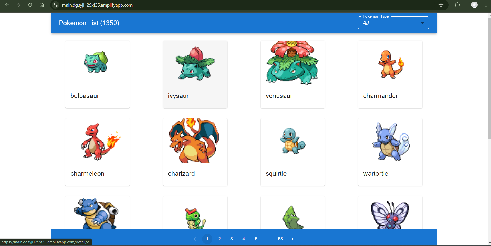
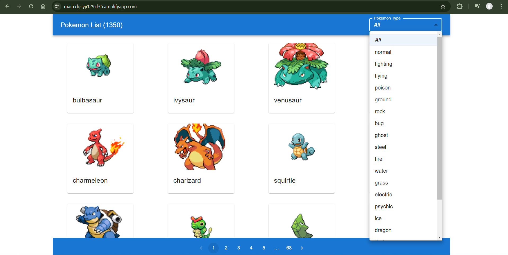
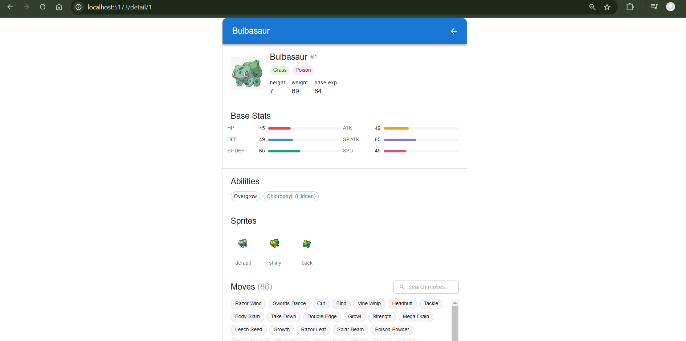

# React MUI AI Project

## Deployed at
https://main.dgsyji129xf35.amplifyapp.com/

## Screenshot

## Prerequisites

- Node.js 20 or higher
- npm 9 or higher

## Project Setup

1. Install dependencies.

	 ~~~bash
	 npm install
	 ~~~

2. Start the development server.

	 ~~~bash
	 npm run dev
	 ~~~

3. Open the local URL shown in the terminal, usually http://localhost:5173.

## Available Scripts

- Start development server

	~~~bash
	npm run dev
	~~~

- Run production build

	~~~bash
	npm run build
	~~~

- Preview production build locally

	~~~bash
	npm run preview
	~~~

- Run tests

	~~~bash
	npm run test
	~~~

- Run tests in watch mode

	~~~bash
	npm run test:watch
	~~~

- Run test coverage

	~~~bash
	npm run coverage
	~~~

## AWS Amplify Deployment

This project includes an Amplify build spec in amplify.yml.

1. Push your code to your Git provider.
2. In AWS Amplify, create a new app and connect your repository branch.
3. Confirm Amplify detects amplify.yml and keeps the build settings from that file.
4. Add SPA rewrite rule in Amplify Hosting:
	 - Source address: /<*>
	 - Target address: /index.html
	 - Type: 200 Rewrite
5. Trigger deploy.

Build artifact folder is dist.

## Tech Stack

- React
- TypeScript
- Vite
- Material UI
- React Query
- Axios
- Vitest + React Testing Library

## Architectural Decisions

1. Routing with page-level containers
	- Routing is centralized in `src/App.tsx` using React Router.
	- Top-level pages live in `src/pages/` (`PokemonList.tsx`, `PokemonDetail.tsx`) so each route owns its layout and screen-level logic.

2.  Reusable components
	- Reusable rendering logic is kept in `src/components/`.
	- `src/components/ListItem.tsx` is responsible for card-based Pokemon list rendering with navigation links to detail pages.

3. API integration in service layer
	- All remote calls are defined in `src/services/api.ts`.
	- Async requests are implemented with Redux Toolkit `createAsyncThunk` to keep components focused on UI state and user interactions.

4. Global state management with Redux Toolkit slices
	- Store setup is in `src/state/store.ts`.
	- Domain separation is done by slice:
	  - `src/state/reducer/pokemonSlice.ts` handles list, count, loading, errors, and selected detail state.
	  - `src/state/reducer/typeSlice.ts` handles Pokemon type metadata for filtering.

5. Centralized constants and typing utilities
	- Static values and API constants are separated into `src/assets/common.ts`.
	- Shared UI/type metadata is kept in `src/types/TypesCommon.ts`.

6. Page-level test coverage
	- Main page behaviors are validated via:
	  - `src/pages/PokemonList.test.tsx`
	  - `src/pages/PokemonDetail.test.tsx`
	- Tests use Vitest + React Testing Library with router/store-aware render helpers.

7. Deployment-friendly static build architecture
	- Vite build output is generated in `dist`.
	- Amplify CI/CD configuration is tracked in `amplify.yml` for repeatable deployments.
	- SPA rewrite (`/index.html`) is required in hosting for deep links like `/detail/:pokemonId`.

## Trade-offs Made

1. Redux Toolkit thunks for server data instead of React Query hooks
Pros: single, predictable async flow in slices and easier global loading/error handling.
Cons: more boilerplate and less benefit from React Query caching features already available in dependencies.

2. Slice-based global state for both list and detail
Pros: centralized state enables route-to-route continuity and simpler data sharing.
Cons: detail data lifecycle is global; stale data management must be handled manually.

3. Page-focused tests over deeper unit-level coverage
Pros: validates real user flows in `PokemonList` and `PokemonDetail` with less test setup duplication.
Cons: lower isolation; internal utility/component regressions may be harder to pinpoint quickly.

4. Per-card image fetch in `ListItem`
Pros: keeps initial list payload lightweight and defers image loading per visible card.
Cons: creates many client-side requests and can impact performance on slower networks.

5. Route-level styling with MUI `sx` and inline styles
Pros: local readability and quick UI changes near component logic.
Cons: style reuse and consistency become harder as the codebase scales without a shared theme layer.

6. BrowserRouter for clean URLs
Pros: user-friendly routes like `/detail/:pokemonId`.
Cons: static hosting requires explicit SPA rewrite rules (for example in Amplify) to avoid direct-link 404s.

## Future Improvements

1. Move server-state fetching to React Query
	- Replace thunk-based list/detail/type fetch flows with query hooks for stronger caching, stale-time control, and retry behavior.

2. Improve TypeScript strictness
	- Replace `any` with domain interfaces for Pokemon, Type, Stats, and API responses to reduce runtime shape errors.

3. Optimize image loading strategy
	- Avoid per-card detail fetch in list cards by deriving image URL from Pokemon ID or by extending list API handling.

4. Strengthen test pyramid
	- Keep page-level integration tests and add focused unit tests for reducers, selectors, and utility mapping logic.

5. Introduce shared UI theme and style tokens
	- Centralize repeated `sx` values in MUI theme/custom tokens for better consistency and easier scaling.

6. Add error boundaries and improved empty/error states
	- Provide clearer fallback UX for network failures and unexpected rendering exceptions.

7. Add CI quality gates
	- Run lint, tests, and build on pull requests to prevent regressions before deployment.

## AI Usage Details (GitHub Copilot)

GitHub Copilot was used as a development accelerator across coding, testing, and documentation, while all decisions and validations were done manually.

1. boilerplate
	- Generated initial React + TypeScript structure and repetitive UI/state boilerplate.
	- Took help from GitHub Copilot to create UI components and reusable templates for faster page development.

2. UI and styling support
	- Suggested MUI component composition (`AppBar`, `Grid`, `Card`, `Chip`, `Pagination`) and `sx` styling patterns.
	- Accelerated iteration for responsive layout and component-level styling refinements.

3. Human validation and ownership
    - Identify and write the unit tests first, and then implement the functionality to satisfy those tests.
	- API contract assumptions and business behavior were manually reviewed.
	- Build and deployment configuration were manually verified.
	- Code suggestions were edited where needed for readability, correctness, and project fit.

